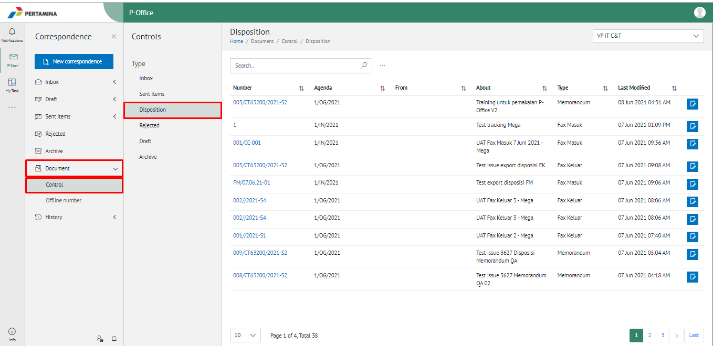

**Role yang sesuai**

- Sekretaris

Sekretaris dapat melihat daftar disposisi yang diterima oleh pejabat atasan

## **P-Office Versi Web**

Langkah-langkah untuk melihat daftar disposisi via Web adalah sebagai berikut

1. Klik menu **Document Control** dan pilih submenu **Document View - Disposisi**

2. Sistem menampilkan dokumen disposisi yang informasinya meliputi no agenda, tanggal, nomor surat, perihal, dari/asal, status dan *secretary notes*

## **P-Office Versi Teams**

Langkah-langkah untuk melihat daftar Disposisi via Teams adalah sebagai berikut:

1. Klik menu **Document Control** dan pilih submenu **Document View - Disposisi**

2. Sistem menampilkan dokumen disposisi yang informasinya meliputi no agenda, tanggal, nomor surat, perihal, dari/asal, status dan *secretary notes*