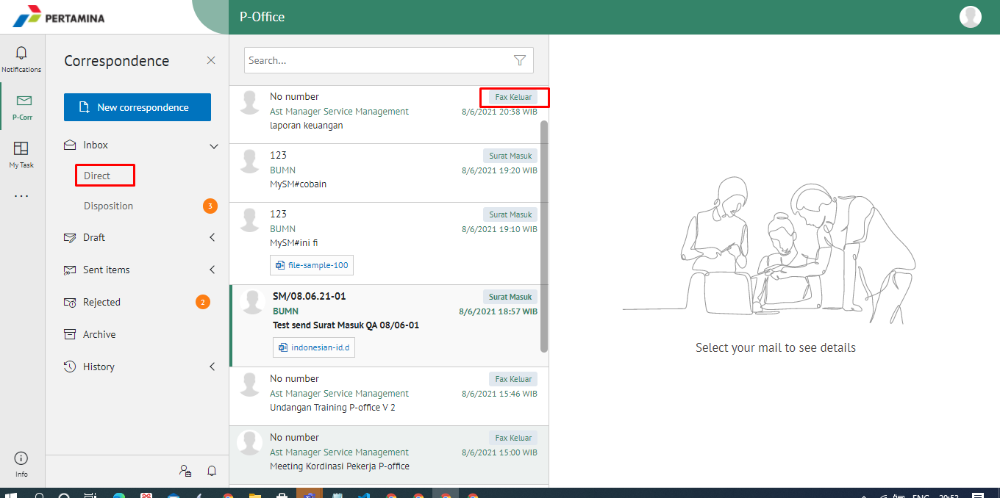

**Role yang sesuai**

- *Approver User*
- *Reviewer User*
- *Member User* (Pekerja)

*User* dapat melihat daftar fax keluar pada pada menu **Inbox, Draft atau Sent Item** pada masing-masing akun. 

## **P-Office Versi Web**

Langkah - langkah untuk melihat daftar fax keluar via Web adalah sebagai berikut :

1. Klik menu **Inbox / Draft / Sent Item** dan pilih berlabel **Fax Keluar**

## **P-Office Versi Teams**

Langkah - langkah untuk melihat daftar fax keluar via Teams adalah sebagai berikut :

1. Klik menu **Inbox / Draft / Sent Item** dan pilih berlabel **Fax Keluar**

## **P-Office Versi Android**

Langkah - langkah untuk melihat daftar fax keluar via Android adalah sebagai berikut :

1. Klik menu **Inbox / Draft / Sent Item** dan pilih berlabel **Fax Keluar**

 

## **P-Office Versi IOS**

Langkah - langkah untuk melihat daftar fax keluar via IOS adalah sebagai berikut :

1. Klik menu **Inbox / Draft / Sent Item** dan pilih tab **Fax Keluar**

 