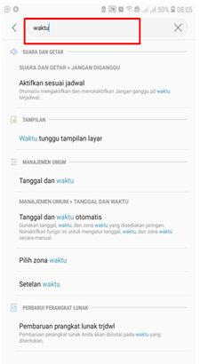

- Kendala tersebut terjadi saat user melakukan scan barcode untuk registasi P-Sign dan sudah mendapatkan kode OTP lalu memasukan kode tersebut di form lalu muncul eror dengan text **“The otp your entered is wrong or system can’t process your request “.**

    

**PERBAIKAN MASALAH**

- Untuk mengatasi agar tidak terjadi eror saat memasukan kode OTP Microsoft Authenticator, berikut ini langkah-langkah untuk setting waktu di handphone dan PC/Laptop secara otomatis :

1.  Klik menu Icon **Setting** di handphone user.

    

2.  Pilih **Manajemen umum** / klik tombol pencarian tanggal dan waktu dikolom pencarian pengaturan.

    
    

3.	Klik **Tanggal dan waktu**

    

4.	Pilih **zona waktu GMT+07:00 Waktu Indonesia Barat**, lalu klik tombol aktifkan di pojok kanan untuk setting tanggal dan waktu otomatis

    

5.	Klik icon pencarian samping logo windows dan ketik **Date & Time Setting**.

    

6.	Klik **Set time automatically** dan pilih **time zone (UTC+07:00) Bangkok,Hanoi, Jakarta**.

    

7.	Selanjutnya masuk ke P-Office, klik logo profil di pojok kanan atas lalu pilih **My personal**.

      

8.	Klik Localization dan atur untuk waktu tersebut dengan ketentuan sebagai berikut:

    

    1)	Default time zone **SE Asia Standard Time +(07.00)**
    2)	Default date format (21/10/21) **d/M/yy**
    3)	Default time format (14:39) **H:mm tt**

