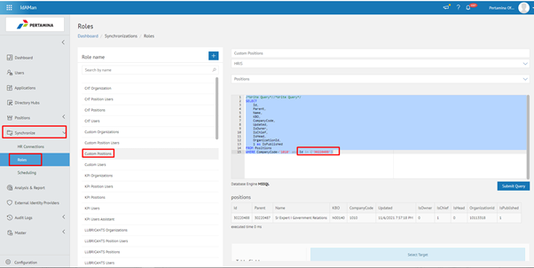
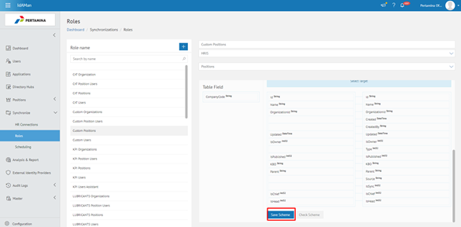
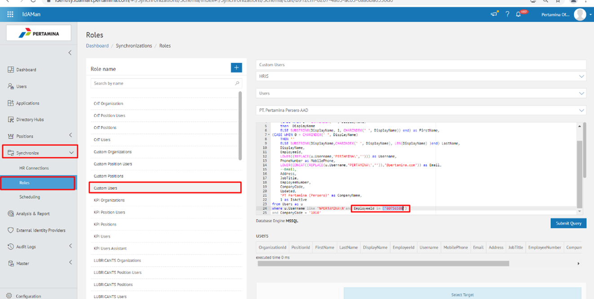
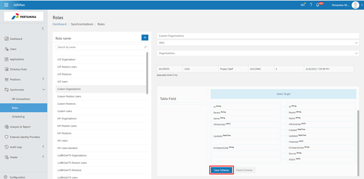
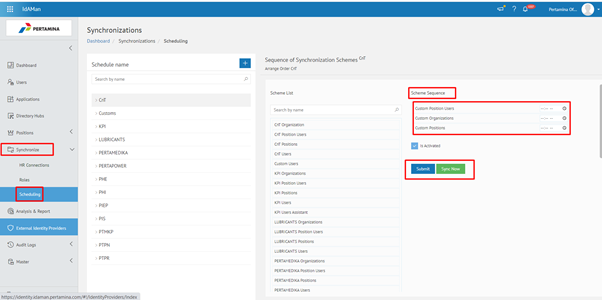
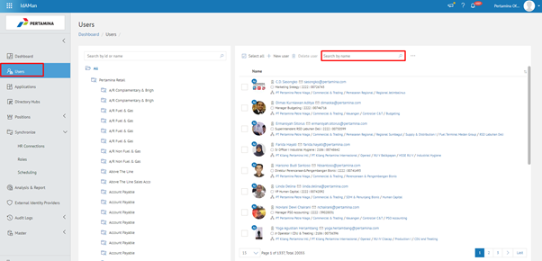
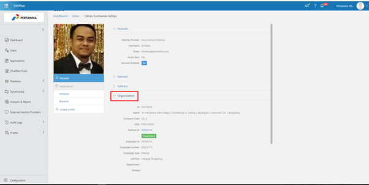
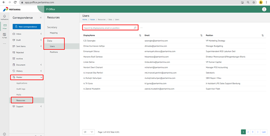

\*\* Nama jabatan belum update

- Nama jabatan di P-office dan Idaman belum update, masih dengan data nama jabatan lama sedangkan Posid sudah yang terbaru

- Melakukan sync parsial pada idaman dengan langkah – langkah sebagai berikut:

1. Buka aplikasi idaman lalu pilih Syncronize – Role kemudian pilih Custom Positions dan masukkan informasi position id dan company code.

    
    
2.	Klik **Save Scheme**

    

3. Kembali ke menu **Role-Custom-User** kemudian Isikan employe id jabatan baru dan company code dan **Save Scheme**

    

    

4. Kemudian kembali ke menu **Role-Custom-Organization** isi bagian organisasi dan company kemudian klik **Save Scheme**

    

5. Pilih menu **Synchronize-Scheduling** kemudian pilih Custom (user, position user, organization), **Submit dan Sync**

    

6. Check user di menu **User** Idaman  kemudian masukan email user pada kolom search untuk memastikan user tersebut sudah terupdate

    

    
    
    

7. Buka aplikasi P-office lalu pilih menu **Master-Resource-Data-User-Search** by display name

    

