Role yang sesuai

- _Approver User_
- _Reviewer User_

_User_ dapat mengembalikan memorandum ke sebelumnya jika hasil review belum / tidak sesuai. Surat akan dikembalikan ke satu level _reviewer_ sebelumnya atau ke konseptor (apabila hanya ada satu _reviewer_).

## **P-Office Versi Web**

Langkah-langkah untuk mengembalikan memorandum ke sebelumnya via Web adalah sebagai berikut :

<<<<<<< HEAD
1. Klik menu **Draft** lalu klik **Direct** dan pilih surat yang berlabel **Memorandum**
=======
1. Klik menu **Draft** dan pilih label **Memorandum**
>>>>>>> bf30ebfe4905e0d4d59486d7c8a41c61957e9082

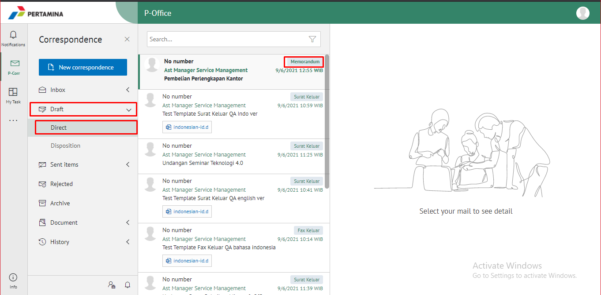

2. Pilih memorandum yang akan ditindak lanjuti kemudian pilih **Detail**

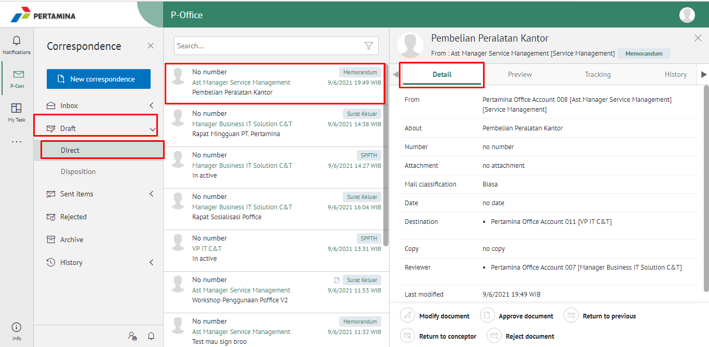

3. Klik tombol **Return Previous** dan pilih **Send**. Isikan komentar jika diperlukan

<<<<<<< HEAD
=======
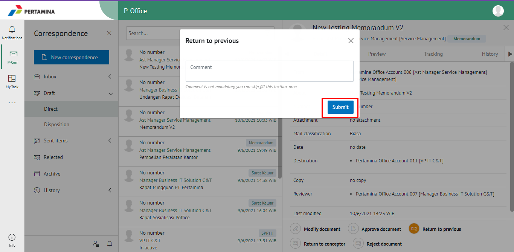
>>>>>>> bf30ebfe4905e0d4d59486d7c8a41c61957e9082

4. Sistem berhasil menyimpan perubahan. Memorandum yang sudah di kirim akan tersimpan di menu **Sent Item - Memorandum** dan penerima pengembalian memorandum akan menerima memorandum di menu **Rejected - Memorandum**

## **P-Office Versi Teams**

Langkah-langkah untuk mengembalikan Memorandum kesebelumnya via Teams adalah sebagai berikut :

1. Klik menu **Inbox** dan pilih tab **Memorandum**

2. Pilih memorandum yang akan ditindak lanjuti kemudian pilih tab **Detail**

3. Klik tombol **Return Previous** dan pilih **Send**. Isikan komentar jika diperlukan

4. Sistem berhasil menyimpan perubahan. Memorandum yang sudah di kirim akan tersimpan di menu **Sent Item - Memorandum** dan penerima pengembalian memorandum akan menerima memorandum di menu **Rejected - Memorandum**

## **P-Office Versi Android & IOS**

Langkah-langkah untuk mengembalikan memorandum ke sebelumnya via Android adalah sebagai berikut :

<<<<<<< HEAD
1. Klik menu **Inbox** dan pilih tab **Direct**

 
=======
1. Klik menu **Draft** dan pilih label **Memorandum**

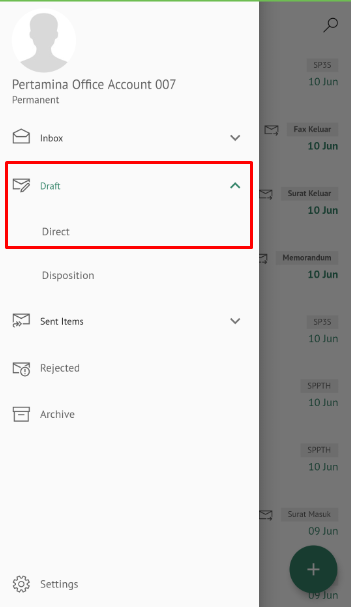 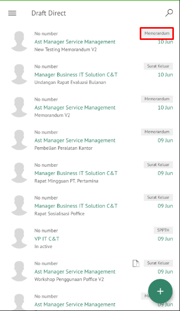
>>>>>>> bf30ebfe4905e0d4d59486d7c8a41c61957e9082

2. Pilih memorandum yang akan ditindak lanjuti.

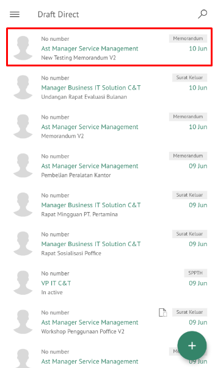 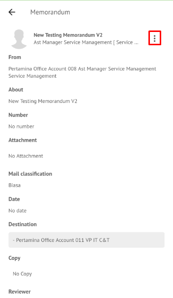

3. Klik tombol **Revise to Previous** dan pilih **Send**. Isikan komentar jika diperlukan

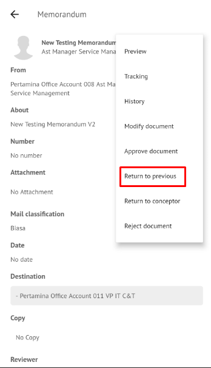 

4. Sistem berhasil menyimpan perubahan. Memorandum yang sudah di kirim akan tersimpan di menu **Sent Item- Memorandum** dan penerima pengembalian memorandum akan menerima memorandum di menu **Rejected - Memorandum**
<<<<<<< HEAD
=======

## **P-Office Versi IOS**

Langkah-langkah untuk mengembalikan memorandum ke sebelumnya via IOS adalah sebagai berikut :

1. Klik menu **Draft** dan pilih label **Memorandum**

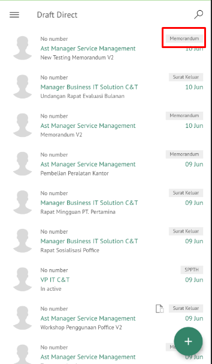

2. Pilih memorandum yang akan ditindak lanjuti kemudian pilih icon **Option** dan pilih **Revise to Previous**

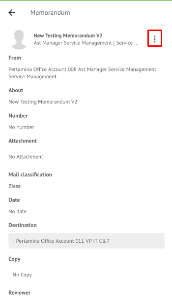 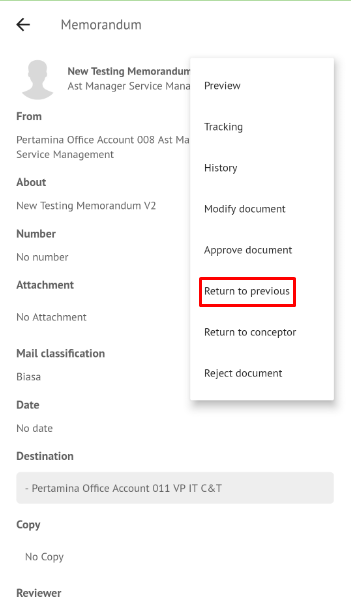

3. Isikan komentar jika diperlukan kemudian klik **Send** untuk menyimpan perubahan. Memorandum yang sudah di kirim akan tersimpan di menu **Sent Item – Memorandum**

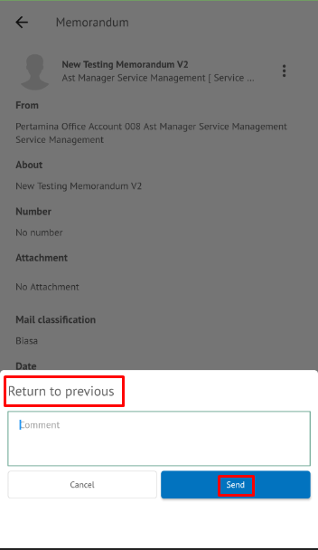

4. Sistem berhasil menyimpan perubahan. Memorandum yang sudah di kirim akan tersimpan di menu **Sent Item - Memorandum** dan penerima pengembalian memorandum akan menerima memorandum di menu **Rejected - Memorandum**
>>>>>>> bf30ebfe4905e0d4d59486d7c8a41c61957e9082
