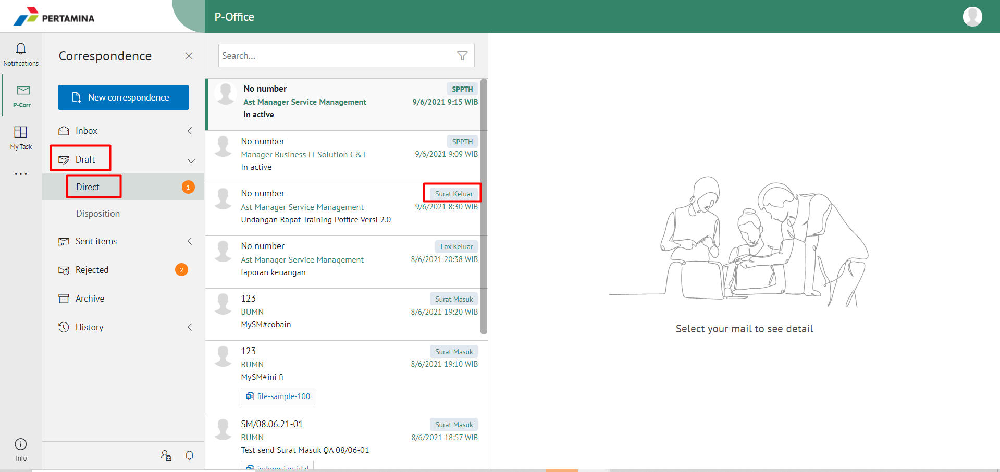

**Role yang sesuai**

- *Approver User*
- *Reviewer User*
- *Member User* (Pekerja)
- Sekretaris

*User* dapat melihat daftar surat keluar pada pada menu **Inbox, Draft atau Sent Item** pada masing - masing akun. 

## **P-Office Versi Web**

Langkah - langkah untuk melihat daftar surat keluar via Web adalah sebagai berikut :

1. Klik menu **Inbox / Draft / Sent Item** dan pilih label **Surat Keluar**

### **P-Office Versi Teams**

Langkah - langkah untuk daftar surat keluar via Teams adalah sebagai berikut :

1.	Klik menu **Inbox / Draft / Sent Item** dan pilih tab **Surat Keluar**

 

## **P-Office Versi Android dan iOS**

Langkah - langkah untuk melihat daftar surat keluar via Android dan iOS adalah sebagai berikut :

1. Klik menu **Inbox/ Draft/ Sent Item** dan pilih tab **Surat Keluar**

 

