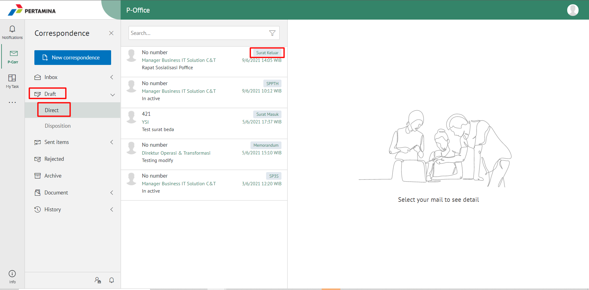
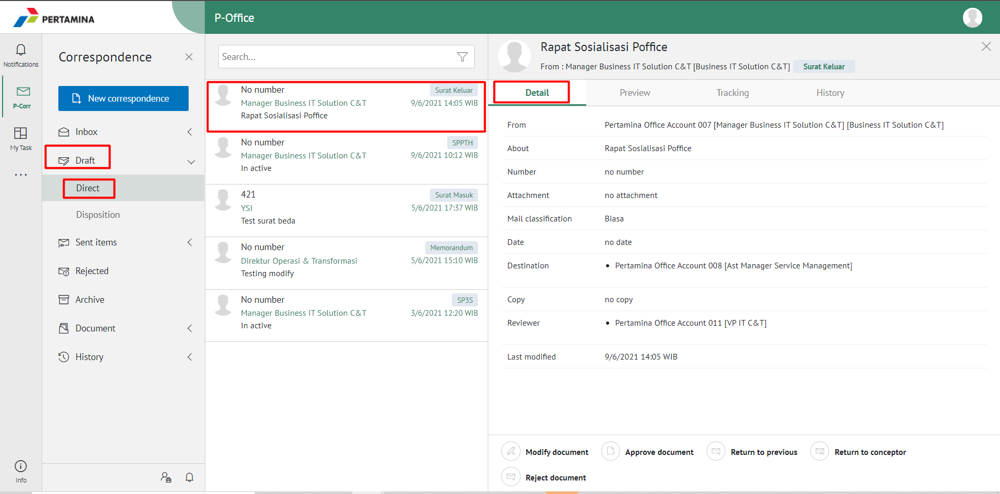
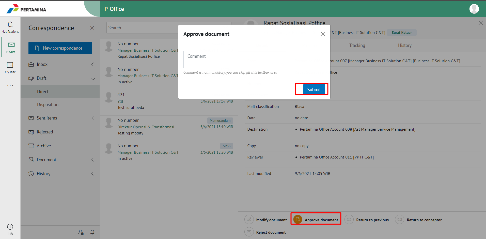
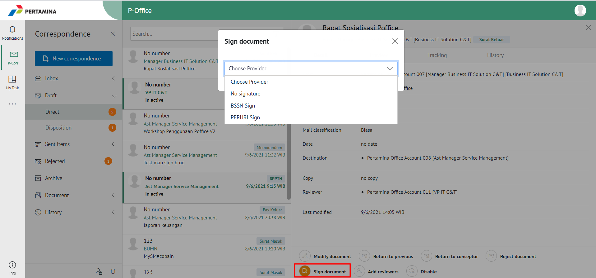
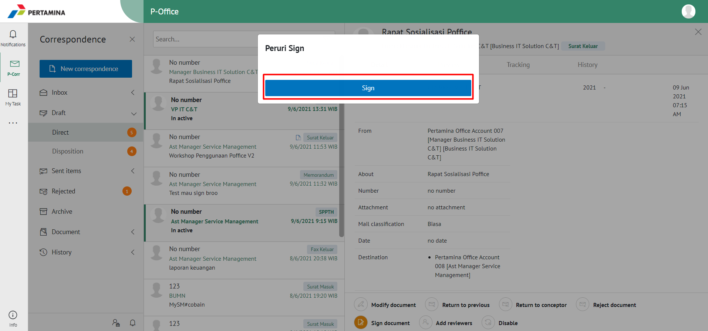

**Role yang sesuai**

- *Approver User*

*User* dapat mengesahkan surat keluar yang sudah dikirim dan direview oleh reviewer. Keluaran untuk tindak lanjut ini adalah untuk men-*generate* nomor surat keluar kemudian surat keluar dapat dikirimkan ke pejabat tujuan. 

## **P-Office Versi Web**

Berikut ini video tutorial yang menjelaskan langkah-langkah untuk mengesahkan surat keluar oleh approver **via Web**. Penandatangan surat keluar dapat menggunakan Digital Sign Peruri/BSSN/tanpa digital sign. Jika pengguna memilih menggunakan Peruri maka akan diarahkan untuk memasukan kode OTP yang dikirimkan ke email dan nomor handphone terdaftar. Jika penggunaa memilih menggunakan BSSN maka akan diarahkan untuk memasukan NIK dan Passphrase sesuai yang terdaftar pada sistem.

 

1. Klik menu **Draft**, Klik menu **Direct** dan pilih label **Surat Keluar**

2. Pilih surat keluar yang akan ditindak lanjuti kemudian pilih tab **Detail**

3. Klik **Approve Document** kemudian pilih **Submit**

4. Pilih **Sign Doucument** menggunakan Peruri/BSSN/tanpa Digital Sign

5. Sistem menampilkan *form* Validation of Digital Signature kemudian masukan kode OTP jika menggunakan Peruri atau masukan NIK dan Passphrase untuk BSSN

6. Klik button **Sign**
 

7. Surat keluar yang sudah disetujui akan tersimpan di menu **"Sent Item - Surat Keluar"** pengirim

## **P-Office Versi Teams**

Langkah-langkah untuk mengesahkan surat keluar via Teams adalah sebagai berikut:

1. Klik menu **Inbox-Direct** dan pilih tab **Surat Keluar**

2. Pilih surat keluar yang akan ditindak lanjuti kemudian pilih tab **Detail**. Pada tab **Detail**
 

3. Klik **Approve** kemudian pilih **Send**
 

4. Pilih tandatangan menggunakan Peruri/BSSN/tanpa DS, Sistem akan menampilkan form Validation of Digital Signature

 
5. Kemudian isikan NIK dan PassPhrase untuk BSSN atau masukan kode OTP untuk tandatangan menggunakan Peruri pada form P-Office kemudian klik **Sign**
 

6.	Surat keluar yang sudah disetujui akan tersimpan di menu **“Sent Item – Surat keluar”** pengirim

## **P-Office Versi Android dan iOS**

Langkah-langkah untuk mengesahkan surat keluar via Android dan iOS adalah sebagai berikut:

1. Klik menu **Inbox-Direct** dan pilih tab **Surat Keluar**

 

2. Pilih surat keluar yang akan ditindak lanjuti kemudian pilih tab **Detail**

 !

3. Pilih tombol **button** kemudian **Approve** 

 

4. Sistem akan menampilkan form Approve Mail & Signing Documents
   

5. Kemudian isikan **NIK** dan **PassPhrase** pada form P-Office kemudian klik **Send**
   

Surat keluar yang sudah disetujui akan tersimpan di menu “**Sent Item - Surat Keluar**” pengirim sedangkan surat keluar akan tersimpan di menu “**Inbox - Surat Keluar**” penerima.

