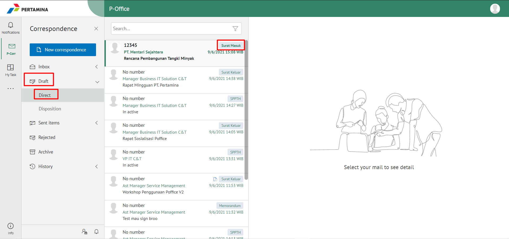
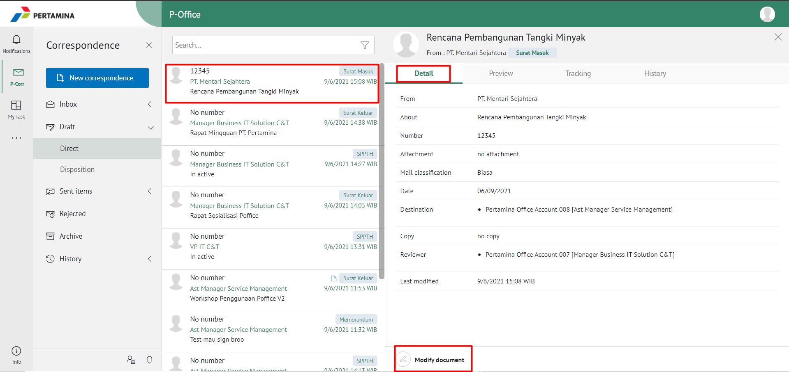
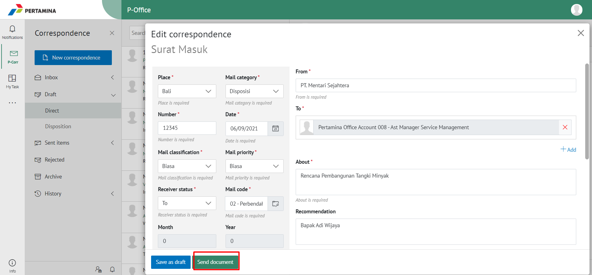

**Role yang sesuai**

- Sekretaris

Sekretaris dapat melakukan _drafting_ surat masuk pada aplikasi P-Office. _Drafting_ surat masuk dilakukan jika _user_ akan meneruskan dan melakukan perubahan pada surat masuk yang sudah disimpan pada menu **Draft.**

## **P-Office Versi Web**

Langkah - langkah untuk drafting surat masuk via Web adalah sebagai berikut :

1.    Klik menu **Draft** dan pilih label **Surat Masuk**

2.    Pilih surat masuk yang akan diubah. Pilih tab **Detail** kemudian klik **Modify document**

3.    Sistem akan menampilkan _form_ **Edit Correspondence**

4.	  Lakukan perubahan pada _form_. Klik **Send Document** untuk mengirim surat masuk ke pejabat tujuan. Surat yang terkirim akan tersimpan di menu "**Sent Item - Surat Masuk"**

## **P-Office Versi Teams**

Langkah - langkah untuk drafting surat masuk via Teams adalah sebagai berikut :

1. Klik menu **Draft** dan pilih tab **Surat Masuk**

2. Pilih surat masuk yang akan diubah. Pilih tab **Detail** kemudian klik **Edit**

3. Sistem akan menampilkan _form_ **Edit Correspondence**

4. Lakukan perubahan pada _form_. Klik **Send** untuk mengirim surat masuk ke pejabat tujuan. Surat yang terkirim akan tersimpan di menu “**Sent Item – Surat Masuk”**

## **P-Office Versi Android dan iOS**

Langkah-langkah untuk Drafting surat masuk adalah sebagai berikut.

1. Klik menu **Draft** dan pilih tab **Surat Masuk**

 

2. Pilih surat masuk yang akan diubah. Pilih tombol **button** kemudian klik **Edit**

  

3. Sistem akan menampilkan _form_ **Edit**

 

4. Lakukan perubahan pada _form_. Klik **Send a Mail** untuk mengirim surat masuk ke pejabat tujuan. Surat yang terkirim akan tersimpan di menu “**Sent Item – Surat Masuk”**

